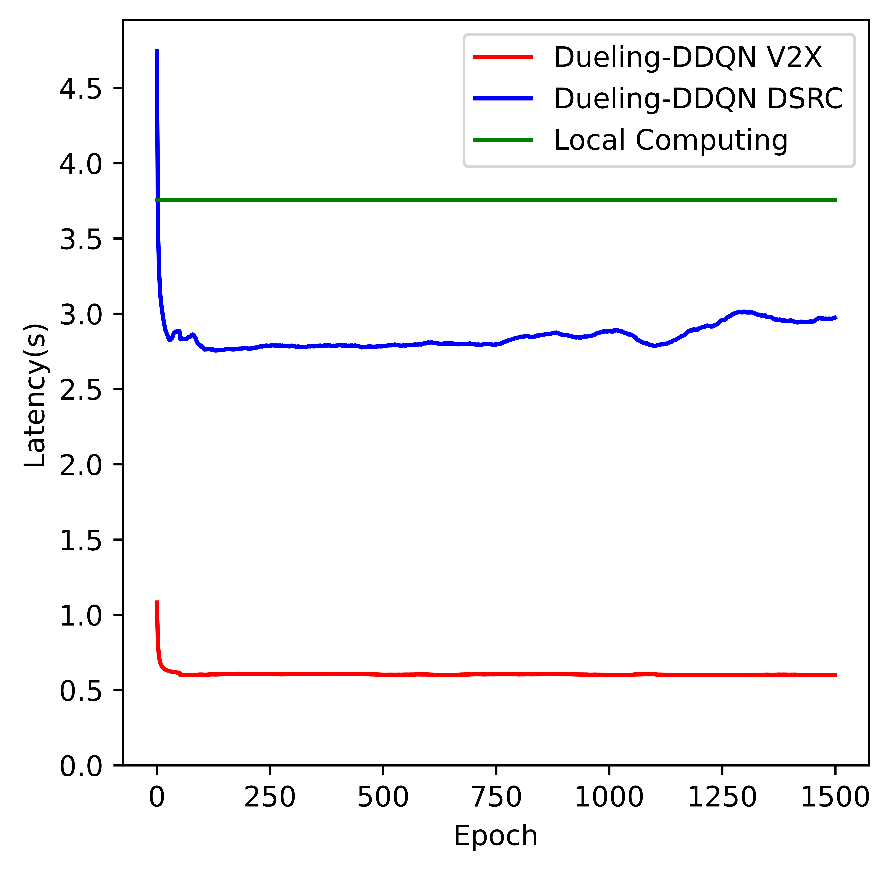
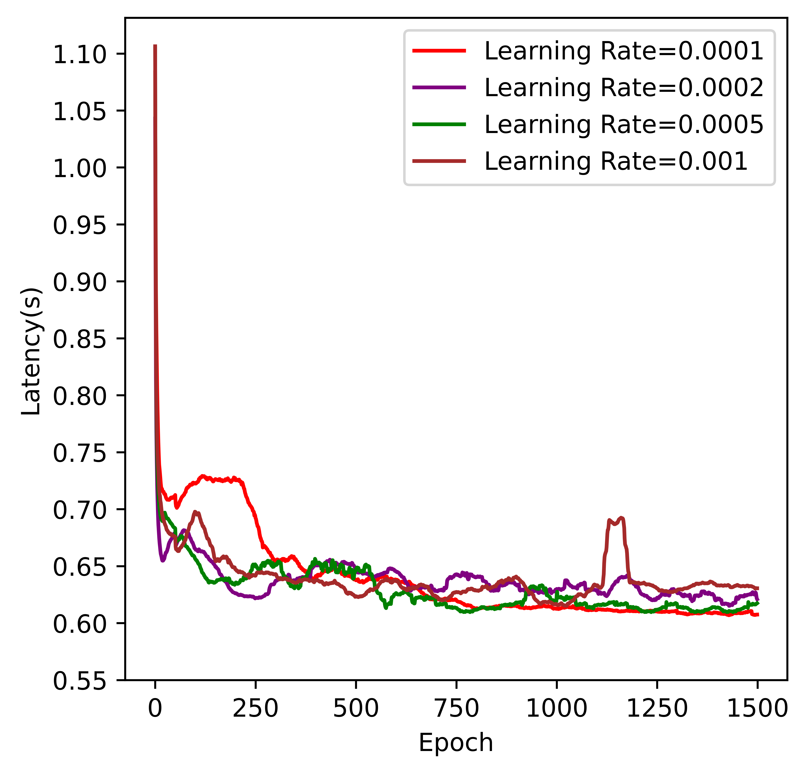
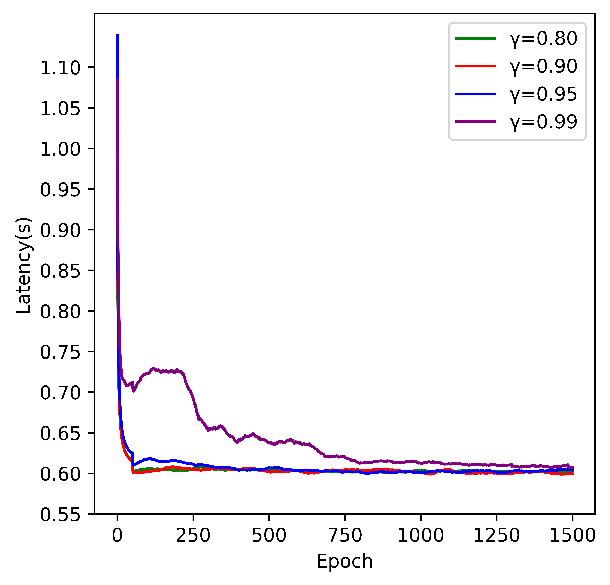
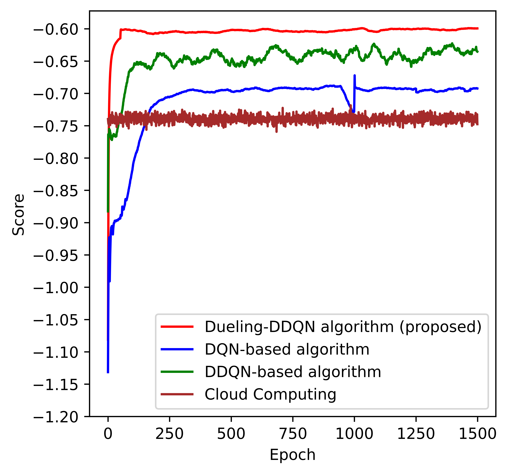
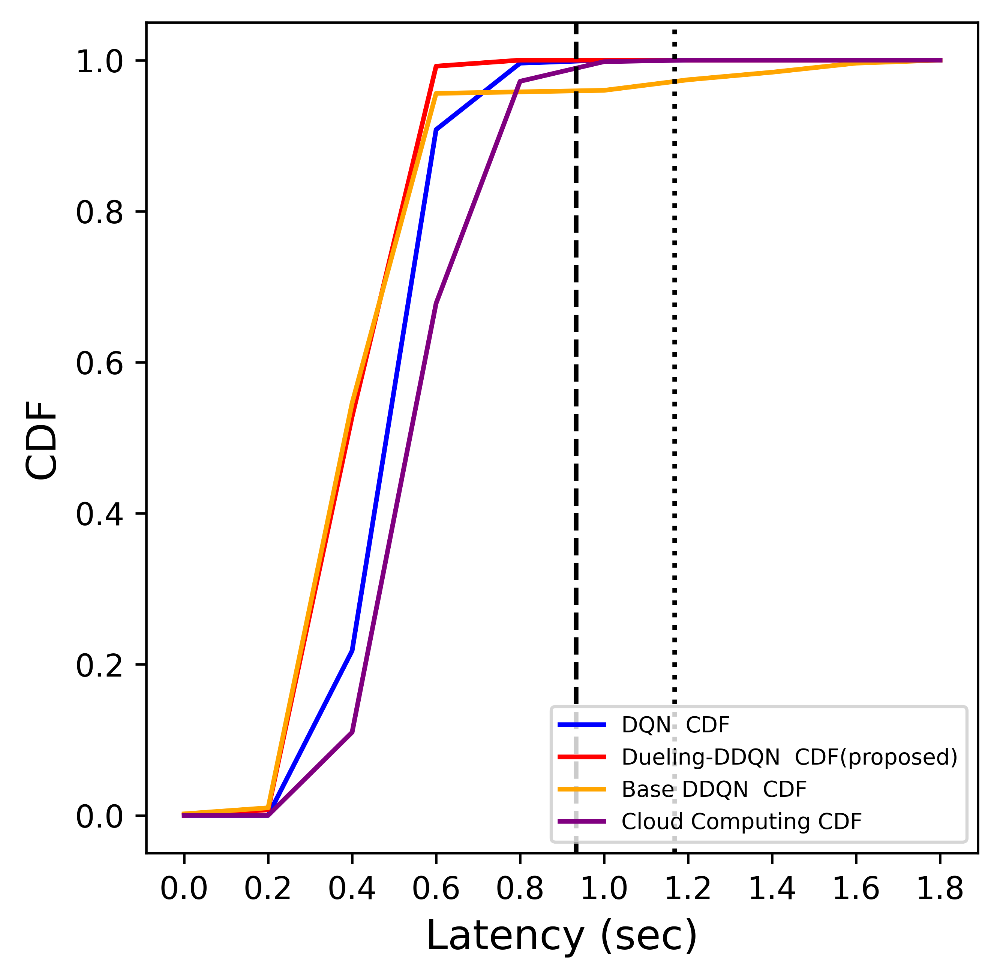

# Dueling-DDQN_CV2X_Offloading
動機:研究提出了一套適用在車載資通訊環境下並具備低延遲的資料計算卸載機制。此機制建立在以 5G-CV2X 的行動網路環境下，本機制採納車輛本機端、多接取邊緣架構伺服器以及雲端伺服器的資料處理負荷等因素，此機制功能包括：透過深度強化學習來動態決定車輛資料計算的卸載和合作策略，使車輛能夠隨著車輛和道路情況動態調整卸載策略、透過計算卸載的方式，有效地分散資料處理負荷使車輛穩定性提高、實現車輛的低延遲卸載和高駕駛安全性。
# 1. 5G傳輸與DSRC傳輸方式比較

## 2. 學習率對Dueling-DDQN影響

## 3. 衰減率對Dueling-DDQN影響

## 4. 不同強化學習在車載環境計算卸載影響 

## 5. 不同強化學習計算時間延遲率

